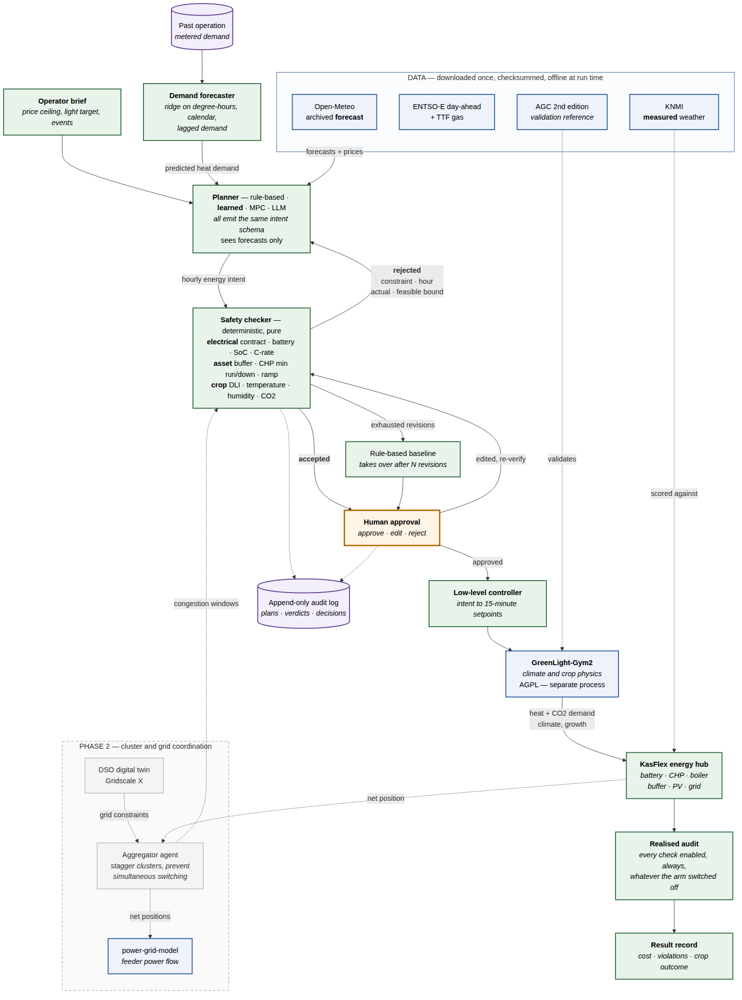

# KasFlex

**Verified agentic energy management for greenhouse horticulture under electrical
constraints.**

An AI planner proposes one day of hourly energy intent for a greenhouse energy hub.
A deterministic safety checker verifies it against electrical, asset and crop limits.
A person approves it. The day is then simulated and compared against conventional
control.

The system exists to produce one measurement:

| | Checker disabled | Checker enabled |
|---|---|---|
| Operating cost | — | — |
| Limit violations | — | — |

> **Simulation only.** No physical greenhouse equipment is connected at any point.
> Nothing here is validated for operational use, and no figure produced with the
> built-in surrogate greenhouse model may be published as a result.

4TU.NIRICT · WUR · TU Delft · TU/e · UT

---

## Try it in two minutes

```bash
python3 -m venv .venv && source .venv/bin/activate
pip install -e ".[dev]"
kasflex experiment --days 3
```

No API key, no downloads, no network. That command runs six experimental conditions
across three days and prints:

```
condition               runs    cost EUR  violations   hard  fallback   peak kW
-------------------------------------------------------------------------------
rule-based                 3    11561.62        0.00      0      0.00      5718
learned                    3    10716.28        0.00      0      0.00      5650
learned-unverified         3    10716.28        0.00      0      0.00      5650
ai-unverified              3    12582.90       65.67    197      0.00     10650
ai-verified                3    11561.62        0.00      0      1.00      5718
ai-verified-silent         3    11561.62        0.00      0      1.00      5718
ai-verified-gap            3    11561.62        0.00      0      1.00      5718
```

Read two rows at a time. `ai-unverified` is a constraint-blind planner let loose: 66
violations, and it costs *more* than the baseline. `ai-verified` is the same planner
with the checker on — rejected until control falls back to the baseline, violations
zero. And `learned` is the data-driven planner: it forecasts tomorrow's heat demand
from past operation, then optimises the schedule against it, coming in about 7%
below the baseline with no violations and no fallback.

Those numbers are **apparatus, not findings** — the greenhouse model is an
unvalidated surrogate and the planner is a fixture. They demonstrate that the
measurement works, which is what the MVP owes at this stage. See the
[MVP plan](docs/MVP_PLAN.md).

## Architecture



Green is KasFlex. Blue is someone else's validated code or data. Orange is the
person. Grey is phase 2. Full description in
[docs/ARCHITECTURE.md](docs/ARCHITECTURE.md).

KasFlex does not implement greenhouse physics or power flow. It wraps
[GreenLight-Gym2](https://github.com/BartvLaatum/GreenLight-Gym2) and
[power-grid-model](https://github.com/PowerGridModel/power-grid-model), and adds
what neither has: market prices, the energy hub, the intent abstraction, the safety
checker, human approval, and the experiment harness.

## The planner

`--planner learned` is two things, and they are deliberately different kinds of thing:

**Prediction is learned.** A ridge regression fitted to the greenhouse's own past
demand, using degree-hours, calendar terms and lagged demand. It reaches a skill
score around 0.55 against a same-hour-yesterday baseline, and its strongest
coefficients are `degree_hours` and `outdoor_temp_c` — it found the heat balance,
not an artifact of the data.

**Scheduling is optimised.** Once demand and prices are known, choosing when to run
the CHP and charge the battery is a constrained optimisation with an exactly known
objective. Learning a policy for that would need more data than a grower has and be
harder to trust than a search that provably cannot return a worse plan than it
started from. So it is a deterministic local search, scored against the *real*
dispatch model rather than an approximation of it.

The most interesting thing to fall out of it: **planning right up to the limit is
worth less than planning with reserve.** An optimiser drains the heat buffer to
exactly its floor, and then any forecast error puts it through. Holding storage back
costs 1.3 points of raw saving and turns 19 rejections into 5, which is worth more.
A cost objective alone would never find that — it is only visible because something
downstream says no. See [ADR-0012](docs/DECISIONS.md).

## The three ideas

**Planners emit intent, not actuator values.** Heat source, lighting level, battery
direction, CHP mode, CO2 source — one record per hour. A deterministic low-level
controller turns accepted intent into 15-minute setpoints. The rule-based baseline
and the MPC reference emit the *same* structure, so the experiment measures the
planner rather than the low-level controller.

**The checker sits between the planner and everything downstream.** Not beside it.
No intent reaches an actuator without a verdict from pure, deterministic code that
has no dependency on the planner. Rejections are machine-readable and name the
constraint, the interval, the actual value and the feasible bound — enough for the
planner to fix the plan rather than resample it.

**Dispatch never repairs a bad plan.** An infeasible request is carried out as
written and the out-of-bounds state is recorded. Clipping it would quietly fix bad
plans and the "checker disabled" column would read zero for the wrong reason.

## Documentation

| | |
|---|---|
| [MVP plan](docs/MVP_PLAN.md) | Build order, requirement coverage, acceptance criteria, risks |
| [Architecture](docs/ARCHITECTURE.md) | The seams and why each is where it is |
| [Decisions](docs/DECISIONS.md) | ADRs, including the AGPL and numpy findings |
| [Usage](docs/USAGE.md) | Every command, and how to extend it |
| [Data](docs/DATA.md) | Datasets, DOIs, licences, provenance |
| [FAIR](docs/FAIR.md) | FAIR assessment, including the gaps |

## Two things to know before you extend it

**`gl-gym` is AGPL-3.0-or-later and pins `numpy<2`; `power-grid-model` needs
`numpy>=2`.** KasFlex core is Apache-2.0 and never imports `gl_gym` — the greenhouse
model runs in a separate process under its own virtual environment. This is
load-bearing for two independent reasons, and `kasflex doctor` will warn you if you
break it. See [ADR-0001 and ADR-0002](docs/DECISIONS.md).

**Validate at 96 m², run scenarios at 5 ha, never mix them.** The scales differ by
a factor of roughly 400. Every energy figure is reported per square metre alongside
its absolute value. See [ADR-0004](docs/DECISIONS.md).

## Status

Stages 0, 2 and the data-driven planner built and tested. 140 tests, 95% coverage, offline.

| Stage | | |
|---|---|---|
| 0 | Skeleton running end to end | ✅ |
| 1 | GreenLight-Gym2, validated against AGC measurements | ⬜ next |
| 2 | Safety checker | ✅ |
| 3 | Real ENTSO-E prices and Dutch weather | 🔶 |
| 4 | Language-model planner | 🔶 built, needs live models |
| 4b | Learned forecaster + optimising scheduler | ✅ |
| 5 | MPC reference | ⬜ |
| 6 | Browser interface | ⬜ |
| 7 | Fleet and grid | 🔶 adapter built |

## Citing

See [`CITATION.cff`](CITATION.cff). If you use KasFlex, please also cite
GreenLight-Gym2 ([10.1016/j.ifacol.2025.11.827](https://doi.org/10.1016/j.ifacol.2025.11.827))
and, where relevant, the Autonomous Greenhouse Challenge dataset
([10.4121/uuid:88d22c60-21b3-4ea8-90db-20249a5be2a7](https://doi.org/10.4121/uuid:88d22c60-21b3-4ea8-90db-20249a5be2a7)).

## Licence

[Apache-2.0](LICENSE) for the core. `workers/greenlight/worker.py` is
AGPL-3.0-or-later, inherited from `gl-gym` and isolated to that one file.
