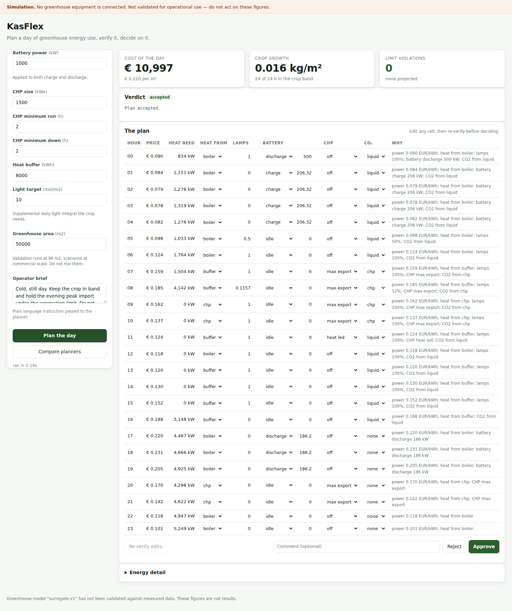

# KasFlex

**An AI plans a day of greenhouse energy use. A safety checker verifies it. A person
approves it.**

Dutch greenhouses own exactly what the congested electricity grid needs — batteries,
CHP units, heat buffers, controllable lighting. An AI could plan when to use them.
But nobody lets an AI near a grid connection without a guarantee it won't do
something dangerous.

KasFlex builds that guarantee, and measures what it is worth.

> **Simulation only.** No greenhouse equipment is connected. Nothing here is
> validated for operational use, and no figure produced with the built-in surrogate
> greenhouse model may be published as a result.

4TU.NIRICT · WUR · TU Delft · TU/e · UT

---

## Try it

**No Python?** Download the application from
[releases](https://github.com/youw98/test/releases) — `KasFlex.exe` on Windows,
`KasFlex` on macOS and Linux — and double-click it. The interface opens in your
browser. Nothing to install.

**From source:**

```bash
python3 -m venv .venv && source .venv/bin/activate
pip install -e ".[dev]"
kasflex experiment --days 3
```

No API key, no downloads, no network. Six seconds later:

```
condition               runs    cost EUR  violations   hard  fallback   peak kW
-------------------------------------------------------------------------------
rule-based                 3    11561.62        0.00      0      0.00      5718
learned                    3    10716.28        0.00      0      0.00      5650
ai-unverified              3    12582.90       65.67    197      0.00     10650
ai-verified                3    11561.62        0.00      0      1.00      5718
```

Read it two rows at a time:

- **`ai-unverified`** — a planner let loose with the checker off. 66 limit
  violations, and it costs *more* than doing nothing clever.
- **`ai-verified`** — the same planner with the checker on. Rejected until control
  falls back to the conventional baseline. Violations: zero.
- **`learned`** — forecasts tomorrow's heat demand from past operation, then
  optimises the schedule. About 7% cheaper than the baseline, no violations.

Those numbers are **apparatus, not findings**: the greenhouse model is not yet
validated. They show the measurement works, which is what this stage owes.

## The interface

```bash
kasflex ui
```



Change the scenario, plan the day, edit any hour, approve or reject. An edited plan
cannot be approved until it has been re-verified. With the checker switched off the
verdict reads *not verified*, never *accepted*.

## Run it every day

```bash
export ENTSOE_API_KEY=...
kasflex daily
```

Fetches day-ahead prices and weather, plans tomorrow, appends a record. Cache-first
and offline-safe. See [deploy/](deploy/README.md) for cron and systemd.

## Documentation

| | |
|---|---|
| [MVP plan](docs/MVP_PLAN.md) | Build order, requirement coverage, risks |
| [Architecture](docs/ARCHITECTURE.md) | How the pieces fit, and why |
| [Decisions](docs/DECISIONS.md) | Why things are the way they are |
| [Usage](docs/USAGE.md) | Every command |
| [Data](docs/DATA.md) | Datasets, DOIs, licences, provenance |
| [FAIR](docs/FAIR.md) | FAIR assessment, including the gaps |
| [Packaging](packaging/README.md) | Building the double-clickable application |

KasFlex does not implement greenhouse physics or power flow. It wraps
[GreenLight-Gym2](https://github.com/BartvLaatum/GreenLight-Gym2) and
[power-grid-model](https://github.com/PowerGridModel/power-grid-model), and adds the
energy hub, the safety checker, human approval and the experiment harness.

**One thing to know before you extend it:** GreenLight-Gym2 is AGPL-licensed and
pins an incompatible NumPy version, so it runs in a separate process under its own
virtual environment. `kasflex doctor` warns if you break that. See
[ADR-0001 and ADR-0002](docs/DECISIONS.md).

## Status

Tested end to end and runs entirely offline. The safety checker, the energy model,
the planners and the interface are built. Validating the greenhouse model against measured data is the
next step, and until it is done every number is marked unvalidated.

## Licence

[Apache-2.0](LICENSE). `workers/greenlight/worker.py` is AGPL-3.0-or-later,
inherited from `gl-gym` and isolated to that one file.
