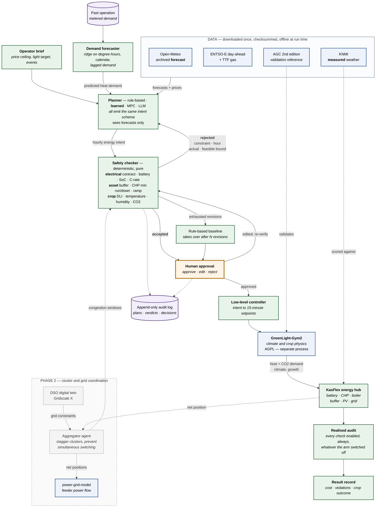

# Architecture

KasFlex is a thin, well-tested coordination layer around models other people have
already validated. Almost everything in this document is about *seams*: where our
code stops and someone else's begins, and why each boundary sits where it does.

## The one-paragraph version

An AI planner sees a **forecast** and proposes one day of **hourly energy intent**.
A deterministic **safety checker** verifies that intent against electrical, asset
and crop limits and, on rejection, hands back a machine-readable reason. A
**person** approves, edits or rejects. A deterministic **low-level controller**
turns the accepted intent into actuator setpoints, which **GreenLight-Gym2** runs as
greenhouse physics while the **KasFlex energy hub** dispatches the battery, CHP,
boiler, buffer, PV and grid connection. The day is then replayed against what
**actually** happened and audited with every check enabled. That audit is the
measurement.

## Diagram

The MVP is the solid path. The dashed path is phase 2: the cluster and DSO layers
from the Alliander proposal, which the MVP is deliberately shaped to grow into
rather than to deliver now.

Green is KasFlex. Blue is someone else's validated code or data. Orange is the
person. Grey dashed is phase 2.

The block above renders on GitHub. The same diagram is also checked in as
[`architecture.svg`](architecture.svg) and [`architecture.png`](architecture.png)
for use in slides and papers; regenerate both from
[`architecture.mmd`](architecture.mmd) with `make diagram`.

## Where this comes from

The hierarchy is the one in Figure 1 of the Alliander proposal — on-site agents
exposing flexibility envelopes, a market intelligence agent, aggregator agents
translating DSO constraints, and a safety and validation layer over all of it. The
MVP implements the **vertical slice**: one site, one planner, and the safety layer
made real and testable. The aggregator and DSO layers are drawn in because the
single-site design has to be able to grow into them, not because they ship now.

The single most important change from that figure is that **safety is not a
sidecar**. In the proposal the safety layer sits beside the agents and validates
their actions. Here it sits *between* the planner and everything downstream: no
intent reaches the low-level controller without a verdict, and the verdict is
produced by pure, deterministic code that has no dependency on the planner at all.
That is what makes "violations with the checker off versus on" a measurement rather
than an assertion.

## The seams, and why each one is where it is

### Planner to checker: the intent schema

The planner emits hourly intent — heat source, lighting level, battery direction
and power, CHP mode, CO2 source — and never an actuator value. Two reasons, and the
second is the one that matters for the experiment:

1. A language model cannot act reliably at a 15-minute control resolution.
2. If the baseline planned actuators while the LLM planned intent, the experiment
   would measure the low-level controller, not the planner. So the rule-based
   baseline and the MPC reference emit the *same* structure. The GreenLight
   rule-based controller still runs, but underneath, as the thing that turns
   accepted intent into setpoints.

### Checker to dispatch: dispatch never repairs a bad plan

`dispatch_plan` carries out an infeasible request as written and records the
resulting out-of-bounds state. Clipping an over-discharge to the battery floor
would quietly fix bad plans, and the "checker disabled" column of the headline
table would read zero for the wrong reason. Feasibility is the checker's job.

The one exception is a genuinely physical limit: a full heat buffer cannot accept
more heat however hard the CHP pushes, so surplus is dumped and reported. The plan
never asked to overfill the buffer — that is a consequence of a CHP setpoint, not a
request — so capping it hides nothing the checker should have caught.

### Hard versus projected violations

A contract breach or an out-of-bounds state of charge is arithmetic. A predicted
indoor temperature is a forward model's guess, and inherits that model's error.
The checker reports the two separately, and by default only the arithmetic ones
reject a plan. Rejecting on a projection would attribute the greenhouse model's
error to the planner and quietly turn a modelling artefact into a safety result.

### Core to GreenLight: a process boundary

KasFlex core never imports `gl_gym`. It launches `workers/greenlight/worker.py`
under a different interpreter and speaks JSON to it. Two independent reasons, either
of which alone would force it — licence and dependency pins. See
[DECISIONS.md](DECISIONS.md) ADR-0001 and ADR-0002.

### Forecast versus actual

Planning uses forecasts. Scoring uses actuals. `PlanningContext` contains only
forecast series, so a planner cannot see the realised day even by accident, and the
runner keeps the actuals to itself until execution. Confusing the two invalidates
every result, so the separation is structural rather than a convention.

### The interface calls the same functions the CLI does

`kasflex.ui.server` holds no model logic. Every endpoint is a call into
`run_scenario`, `SafetyChecker` and `dispatch_plan` — the same entry points a
scripted run uses — so what the browser shows cannot drift from what
`kasflex experiment` produces. Scenario overrides round-trip through
`ScenarioConfig.from_dict`, which means the interface gets exactly the validation a
YAML file does, including the rejection of unknown keys. An interface able to set a
field the config parser would refuse is an interface that can produce runs nobody
can reproduce from a file.

### The realised audit is independent of the condition under test

After execution, the day is audited by a checker with **every** check enabled,
regardless of which checks the experimental arm had switched off. If the audit
honoured the same exclusions, an unverified run would score clean and the headline
table would measure nothing.

## Module map

| Module | Responsibility |
|---|---|
| `kasflex.intent` | The intent schema. Parses and validates planner output. |
| `kasflex.checker.rules` | The named, individually switchable checks. |
| `kasflex.checker.verdict` | Machine-readable rejections and planner feedback. |
| `kasflex.energy.assets` | Asset models and limits, in explicit units. |
| `kasflex.energy.dispatch` | Deterministic intent-to-flows, faithful to the plan. |
| `kasflex.controllers.*` | Rule-based, naive fixture, learned, LLM, MPC (stage 5). |
| `kasflex.controllers.scheduler` | Learned planner: forecast plus local-search scheduler. |
| `kasflex.forecast.*` | Demand model, features, history construction, backtesting. |
| `kasflex.adapters.greenhouse` | The physics seam plus the unvalidated surrogate. |
| `kasflex.adapters.greenlight_worker` | Subprocess client for GreenLight-Gym2. |
| `kasflex.adapters.grid` | power-grid-model feeder check (phase 2). |
| `kasflex.data.registry` | Datasets with DOIs, licences and access routes. |
| `kasflex.data.cache` | Checksummed local cache with a provenance manifest. |
| `kasflex.data.synthetic` | Deterministic offline fallback, weather and prices. |
| `kasflex.data.sources` | ENTSO-E and Open-Meteo fetchers; parsers pure and testable. |
| `kasflex.data.pipeline` | The daily job: cache-first, offline-safe, idempotent. |
| `kasflex.oversight` | Approval, edits, append-only audit log. |
| `kasflex.ui.server` | Local JSON API over the same functions the CLI uses. |
| `kasflex.ui.static` | The single page: settings, plan, approval, comparison. |
| `kasflex.resources` | Where files live when frozen into an executable. |
| `kasflex.run` | One scenario, end to end, to one result record. |
| `kasflex.experiment` | The matrix, unattended. |
